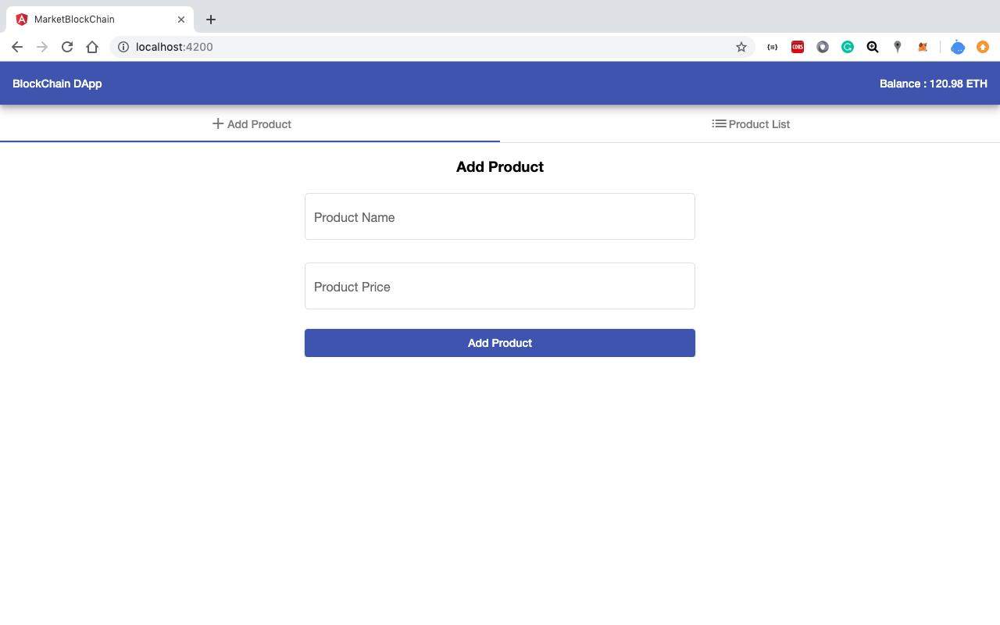
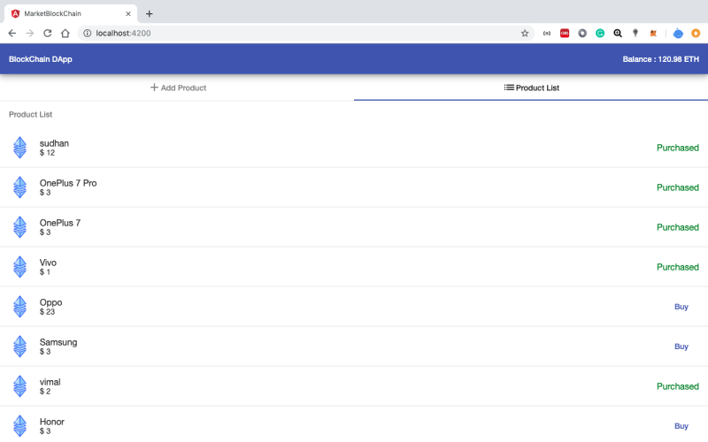

# MarketBlockChain

# Ethereum Decentralized application
This document provides you the guidance on how to create a decentralized application and test on ethereum blockchain network by using Ganache and I wrote the test-case under the test folder.

### Screen Shots


#

#

#

##### Tools and Frameworks
We are using following tools and frameworks for this application
* [truffle](https://www.trufflesuite.com/) - as development tool.
* [Ganache](https://www.trufflesuite.com/ganache) - as ethereum development test network.
* [Metamask](https://chrome.google.com/webstore/detail/metamask/nkbihfbeogaeaoehlefnkodbefgpgknn) - as Web3 Api injector
* [angular-cli](https://cli.angular.io/) - as framework for web client application.
* [Chai](https://www.npmjs.com/package/chai) - as javaScript frameworks commonly used for unit testing.


The steps are
- Download and Install Ganache
- Install truffle by [NPM](https://www.npmjs.com/package/truffle)
- Create truffle project structure
- Create smart contract [Solidity](https://solidity.readthedocs.io/en/v0.5.12/)
- Compile and deploy the smart contract
- This project was generated with [Angular CLI](https://github.com/angular/angular-cli) version 7.3.8.
- Interact with blockchain with smart contract method

##### 1. Install Ganache
Download and install ganache based on your OS. ganache comes guid and cli mode. lets use gui one now
http://truffleframework.com/ganache/
If you open ganache after install, you can see 10 fake ethereum accounts with balance of 100 ether  for each  account.

##### 2. Truffle Project
install truffle and Create truffle project
Create a directory 'ethereumdapp' and create truffle project. use 'truffle init' command
```sh
macs-MBP:MarketBlockChain Sudhan$ npm install -g truffle
macs-MBP:MarketBlockChain Sudhan$ truffle init
Downloading...
Unpacking...
Setting up...
Unbox successful. Sweet!
Commands:
  Compile:        truffle compile
  Migrate:        truffle migrate
  Test contracts: truffle test
```
##### 3. Create simple smart contract
Now I create smart contract file. we use solidity as smart contract programming language version ^0.5.0.
The purpose of this contract is to initiate a state variable in the blockchain and manipulating that value of that variable by invoking our smart contract method from a dapp.

##### 4. Compile the contract
Use 'truffle compile' the contract
```sh
macs-MBP:MarketBlockChain Sudhan$ truffle compile
Compiling your contracts...
===========================
> Compiling ./contracts/MarketPlace.sol
> Artifacts written to /Users/Sudhan/Blockchain/MarketBlockChain/build/contracts
> Compiled successfully using:
   - solc: 0.5.8+commit.23d335f2.Emscripten.clang
```
It creates a MarketPlace..json into the /build folder
this files contains the ABI details for the contract, meaning that Application Binary Interface. The Application Binary Interface (ABI) is a data encoding scheme used in Ethereum for working with smart contract. this can be used in later stage of this process.

##### 5. Deploy the contract
Till now, we have created smart contract and compiled. Now the time for deploy the contract to blockchain which is the ganache, the test blockchain.
For that, we need to configure this project with the blockchain address and port number which is available in ganache settings. We can provide this information truffle.js or truffle-config.js in the project folder.
```sh
module.exports = {
  networks: {
    development: {
      host: '127.0.0.1',
      port: 7545,
      network_id: '*' // Match any network id
    }
  }};
```

##### 6. Metamask
Metamask acts as web3 injector to our page.

- Add extension to your chrome browser
- Add custom RPC with your ganache rpc url which would http://localhost:7545
- You can see your ganache generated first account in metamask accounts list
- You user submits a change from page which invokes the contract method, metamask asks for confirmation

Now ready to the serve the app

#

For help: contact

- Sudhan Manoharan
- sudhanmanoharan@gmail.com
